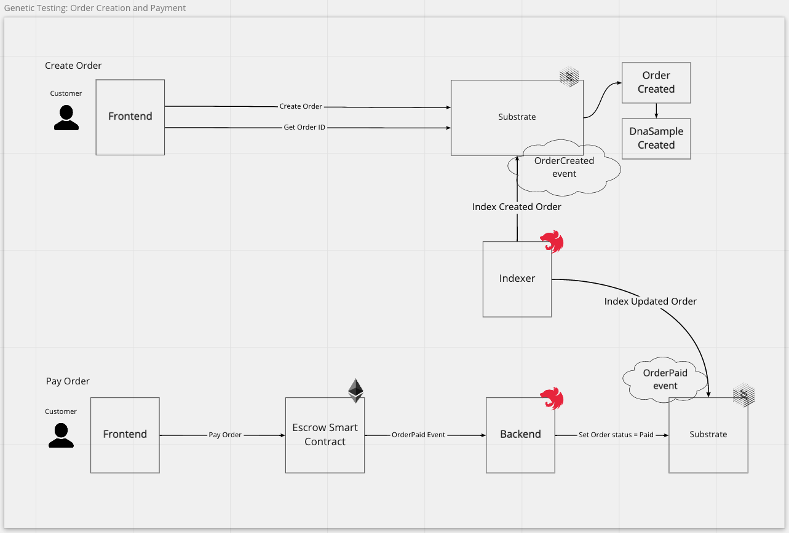
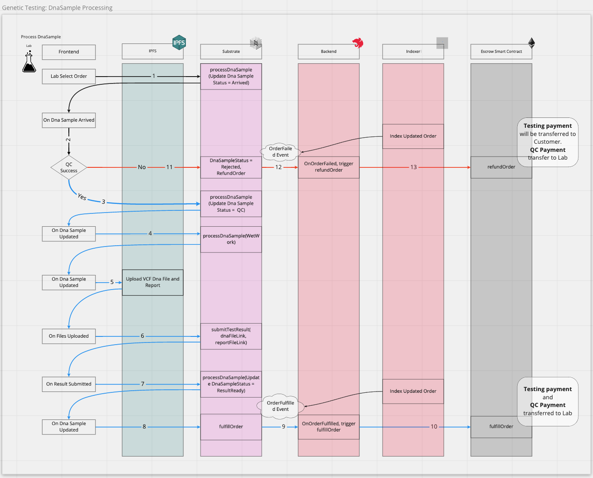

# Feature Implementation Overview

## Genetic Testing Service

### Order Creation and Payment
Orders are created in DeBio's Substrate blockchain.
Payments are made in Ethereum network using DAI ERC20 token.
The payment is transferred to an Escrow smart contract.
When a payment is successfully made to the smart contract, an "OrderPaid" event is emitted.
The event is listened by DeBio's backend which will set the status of the corresponding Order in substrate blockchain to "Paid".
The payment amount will be held in the Escrow smart contract until the DnaSample of the coresponding Order is fulfilled.

### DNA Sample Processing
Dna Sample processing is done on Substrate, IPFS, Backend service, and Escrow Smart Contract in the Ethereum network.

#### DNA Sample Processing Steps
Lab uses Frontend Web App to update Dna Sample status as it progress through the processing steps.
The action of updating the status is done on Substrate blockchain.
1. `processDnaSample("Arrived")` -> DnaSampleStatus = Arrived
2. Quality Control:  
    - if success -> Continue to step 3.
    - if failed  -> Continue to step 11.
3. `processDnaSample("QualityControlled")` -> DnaSampleStatus = QualityControlled.
4. `processDnaSample("WetWork")` -> DnaSampleStatus = WetWork.
5. Upload Test Results -> Upload genomic file and report file to **IPFS**, submit the uploaded links to substrate Blockchain 
6. `submitTestResult(dnaFileLink, reportFileLink)` to Substrate blockchain. 
7. `processDnaSample("ResultReady")` -> DnaSampleStatus = ResultReady
8. trigger `fulfillOrder` on Substrate

##### Upload DNA Test Result Files to IPFS (Step 5)
Before updating the status of DnaSample to ResultReady, Lab has to submit uploaded genomic file and report file link.
The link is retrieved after uploading the files to IPFS directly from Frontend Web App.

##### Order Fulfillment and Payment Forwarding to Lab (Steps 9, 10)
When DnaSample has been successfully processed,  
9. Substrate blockchain will emit the event `OrderFulfilled`.  
10. Backend will trigger `fulfillOrder` transaction in the Escrow Smart Contract. This transaction will forward the order payment in the escrow to the Lab.

##### Order Failed and Refund (Steps 11, 12, 13)
11. When DnaSample QC fails, its DnaSampleStatus is set to Rejected, and the corresponding Order status is set to Failed.
12. `OrderFailed` event will be emitted and listened by Backend.  
13. Backend will trigger Escrow Smart contract's function `refundOrder`. The result of this transaction is QC payment will be forwarded to Lab, while Testing price will be refunded to Customer. 

---
## Request Service Staking
Users create a service request by calling the transaction `createRequest` in ServiceRequest smart contract.
Labs can claim a request by creating an offer to the request by calling the transaction `claimRequest`.
Only labs that are curated can claim a request.
Labs are curated by DAOGenics. The DAOGenics wallet curate a lab by calling the transaction `curateLab`. It can also remove a lab from the curated list by calling `uncurateLab`.

### Customer Create Request
[miro](https://miro.com/app/board/o9J_l4oDB-g=/?moveToWidget=3074457364121820998&cot=14)

### Curate / Uncurate Lab
[miro](https://miro.com/app/board/o9J_l4oDB-g=/?moveToWidget=3074457364122308668&cot=14)

### Lab Claim Request
[miro](https://miro.com/app/board/o9J_l4oDB-g=/?moveToWidget=3074457364122243278&cot=14)

### Customer Process Request
[miro](https://miro.com/app/board/o9J_l4oDB-g=/?moveToWidget=3074457364121997893&cot=14)

---

## Data as a Service Bounty
TODO:

